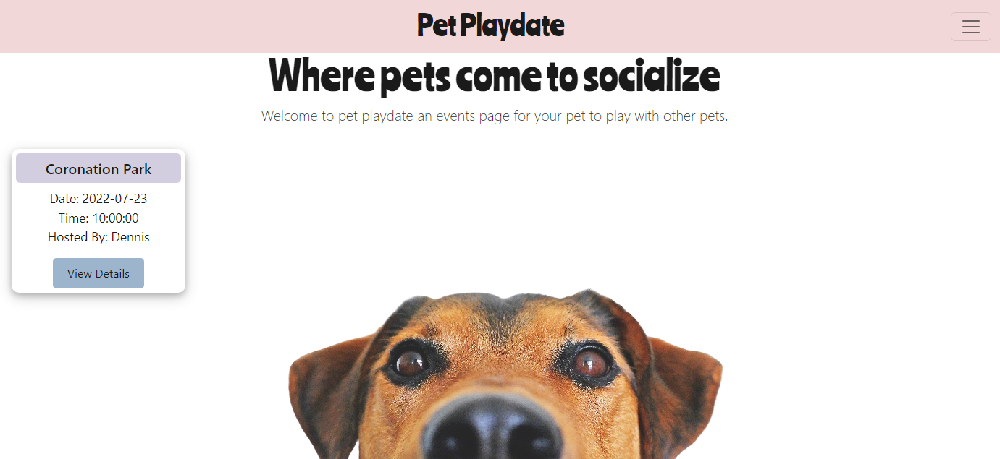

# Pet Play Date

## Table of Contents
- [Description](#description)
- [Developers](#developers)
- [Installation](#installation)
- [Usage](#usage)
- [Application](#application)
- [images](#images)
- [Tests](#tests)
- [questions](#questions)
- [Contributing](#contributing)
- [License](#license)
- [Copyright](#copyright)

## Description
- Is your pet lonely? Do you wish that they would stop watching tv all day? Setup a pet playdate today!

## Developers
- https://github.com/abdallajama201
- https://github.com/Sadegh777
- https://github.com/DLittlefield81/

## Installation
Follow these steps to install this project on your local machine.
- Open Bash editor
- mkdir pet-playdate
- cd pet-playdate
- git clone https://github.com/DLittlefield81/pet-playdate.git
- npm i

## Usage
- After cloning this repository...
- Production mode: npm start
- Developer mode: npm run dev

## Application
- Link to Deployed Application: https://pet-play-date.herokuapp.com/

## Images
- -

## Tests
- node run test

## Questions
- Username: 
- GitHub: 
- Email: 

## Contributing
- If you would like to contribute...
- Email Me

## License
   This project is licenses under the General Public License v3.0 license.

## Copyright
- © Copyright 2022 Pet Play Date
